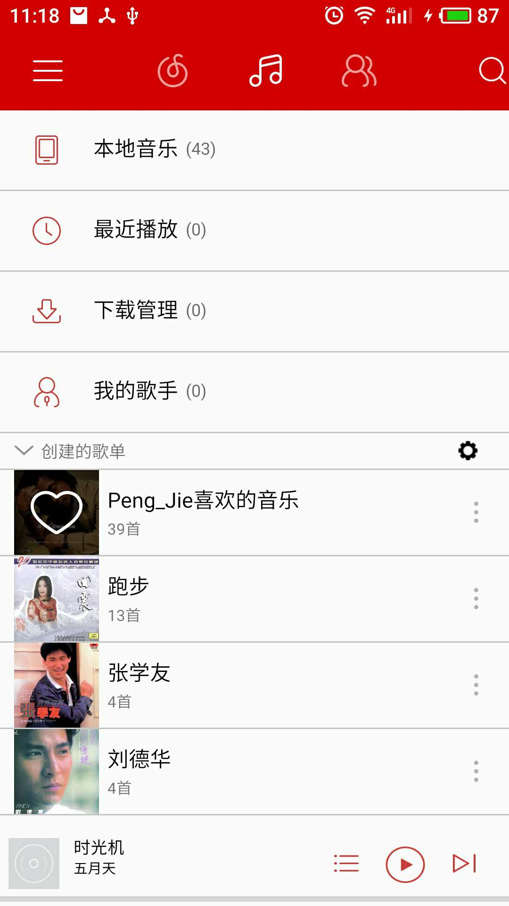
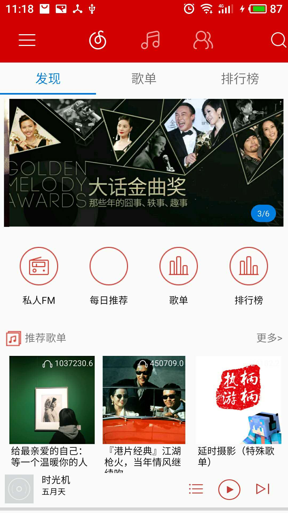
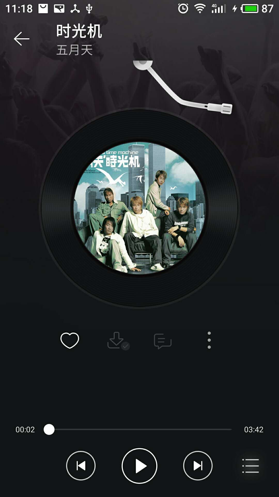
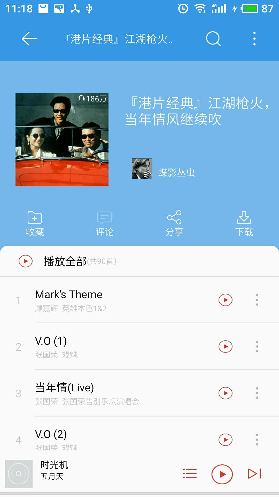

# SwangyiMusic

###项目说明
1. 思路和部分逻辑参考网易云音乐
2. 核心逻辑全部手写，各别功能模块copy
3. 服务端运行在本地

###项目使用

首先感谢[阿发](https://github.com/Binaryify/NeteaseCloudMusicApi)提供的接口，详细文档点[这里](https://binaryify.github.io/NeteaseCloudMusicApi/#/?id=%E8%8E%B7%E5%8F%96%E6%AD%8C%E6%9B%B2%E8%AF%A6%E6%83%85)

根据文档上的方法，需要先下载node.js，然后将服务端程序运行在本地电脑。
以我的为例，根路径为http://192.168.1.112:3000/

对于接口测试，推荐一款软件[postman](https://www.getpostman.com/)

###项目涉及的部分知识点

1. IPC过程，播放音乐的服务运行在remote进程
2. MVP+RxAndroid_Retrofit模式的使用
3. Activity和Service之间数据的传递和通信
4. 多线程断点下载音乐
5. GreenDao操作数据库(保存下载状态)
6. RecyclerView在复杂场景的使用
7. 通知栏和App之间数据的交互和控制
8. 沉浸式状态栏适配
9. FragmentStateViewPager和Fragment的复杂使用场景，以及理解
10. 多层嵌套Fragment的懒加载思路
11. 未完待续...

####项目截图

该App暂时只实现了部分核心功能,且有很多细节bug,但是作者正在不断完善中
